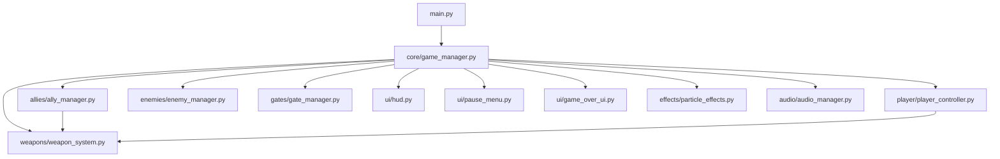

# Game Architecture

The Mob Shooter Defense game prototype is built using a modular, decoupled architecture where each component is isolated into a separate package. This allows for high maintainability, readability, and future expandability (such as porting to mobile controls).

## Component Overview

### 1. Game Manager (`core/game_manager.py`)
Acts as the central orchestrator. It controls the game state (active, paused, game over), updates all subsystems in the main game loop, and handles infinite road tiling.

### 2. Player Controller (`player/player_controller.py`)
Manages the user's primary character. Handles keyboard input, clamps movement within the horizontal borders of the track, and automatically steps forward along the Z axis.

### 3. Ally Manager (`allies/ally_manager.py`)
Spawns and maintains teammate entities. Positions teammates in a V-shaped or grid formation trailing behind the player. Teammates automatically track and fire at the current weapon speed.

### 4. Enemy Manager (`enemies/enemy_manager.py`)
Coordinates enemy wave spawning and movement. Performs high-performance collision checks against active bullets, the player, and allies. Contains basic, fast, and giant tank enemy types.

### 5. Weapon System (`weapons/weapon_system.py`)
Holds configurations for all weapon tiers (Pistol, Dual Pistol, SMG, Rifle, Minigun). Maintains an object-pooled list of bullet entities to minimize memory allocations.

### 6. Gate Manager (`gates/gate_manager.py`)
Handles pairs of math gates (+X and xY). Detects when the player triggers a gate and instructs the `AllyManager` to modify the player's crowd count accordingly.
